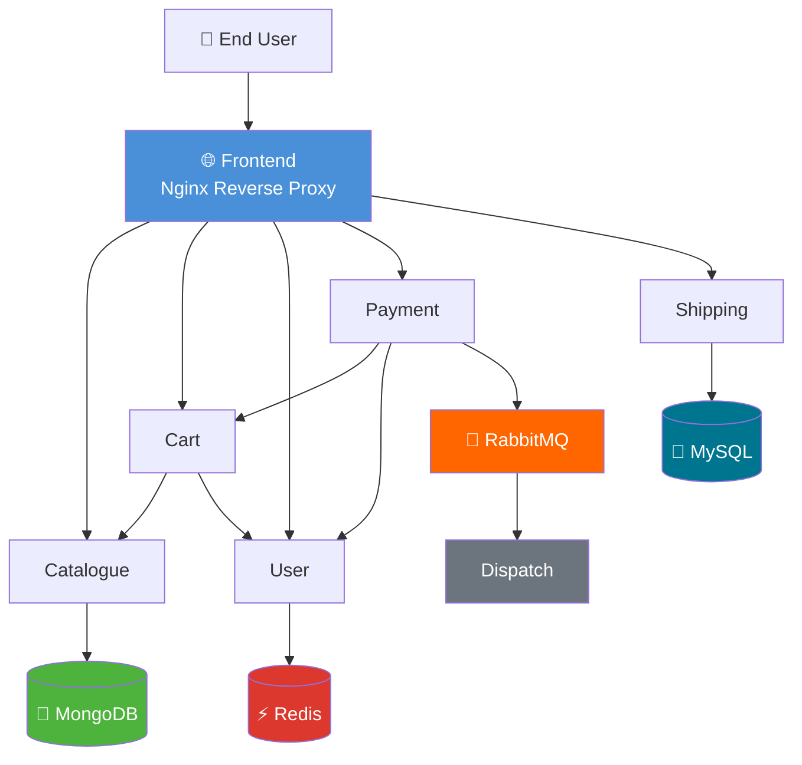

# roboshop-shell-provisioning

> Bash-based provisioning scripts for the RoboShop e-commerce platform. Uses a shared function library (`common.sh`) to eliminate repetition across all service installation scripts.

---

## Overview

This repository contains shell scripts that install, configure, and start each service in the RoboShop microservices stack on individual EC2 instances. Every service script is thin by design — it delegates all boilerplate (logging, root checks, error handling, artifact downloads, user management, and service control) to a shared library, `common.sh`.

This is the **shell scripting layer** of the RoboShop automation suite. The Ansible-based repos in this suite supersede these scripts for config management at scale, but these scripts remain the fastest way to provision a single service on a bare instance with no tooling dependencies beyond Bash.

---

## Architecture

### Service Topology

The RoboShop platform is a microservices e-commerce application. Each service runs on a dedicated EC2 instance and communicates with its dependencies over private DNS.



### How `common.sh` Works

Every service script sources `common.sh` and calls its functions in sequence. This diagram shows the standard execution flow for any service:

```mermaid
flowchart LR
    A["source common.sh"] --> B["check_root_access()"]
    B --> C["logs_creation()\n/var/logs/shell-roboshop/<script>.log"]
    C --> D["start_time()"]
    D --> E["Install packages\ndnf / custom repo"]
    E --> F["system_user()\ncreate roboshop user"]
    F --> G["download_code()\nS3 artifact fetch → /app"]
    G --> H["Service-specific config\n(schema load, env vars, etc.)"]
    H --> I["start_enable_service()\nsystemctl enable + start"]
    I --> J["end_time()\nprint duration"]

    style A fill:#333,color:#fff
    style C fill:#1a73e8,color:#fff
    style G fill:#1a73e8,color:#fff
    style I fill:#1a73e8,color:#fff
```



---

## Repository Structure

```
.
├── common.sh            # ⭐ Shared function library — sourced by all service scripts
│
├── 0-instances.sh       # Provision EC2 instances on AWS
├── 1-mongodb.sh         # Install & configure MongoDB
├── 2-catalogue.sh       # Install Catalogue service (Node.js)
├── 3-redis.sh           # Install & configure Redis
├── 4-user.sh            # Install User service (Node.js)
├── 5-cart.sh            # Install Cart service (Node.js)
├── 6-mysql.sh           # Install MySQL + seed schema
├── 7-shipping.sh        # Install Shipping service (Java)
├── 8-rabbitmq.sh        # Install & configure RabbitMQ
├── 9-payment.sh         # Install Payment service (Python)
├── 10-dispatch.sh       # Install Dispatch service (Go)
├── 11-frontend.sh       # Configure Nginx frontend
│
├── catalogue.service    # systemd unit — Catalogue
├── cart.service         # systemd unit — Cart
├── user.service         # systemd unit — User
├── shipping.service     # systemd unit — Shipping
├── payment.service      # systemd unit — Payment
├── dispatch.service     # systemd unit — Dispatch
├── nginx.service        # systemd unit — Nginx (Frontend)
│
├── mongo.repo           # MongoDB yum repository definition
└── rabbitmq.repo        # RabbitMQ yum repository definition
```

---

## `common.sh` — Function Reference

This is the shared library at the heart of this repo. All service scripts `source ./common.sh` before calling any functions.

| Function | Purpose |
|---|---|
| `check_root_access` | Exits with error if script is not run as root |
| `error_handler <label>` | Checks `$?` from the last command; prints ✅ success or ❌ failure with label, exits on failure |
| `logs_creation` | Creates `/var/logs/shell-roboshop/` and sets `$log` to the per-script log file path |
| `start_time` | Records start timestamp and prints execution start message |
| `end_time <label>` | Calculates and prints total elapsed time in seconds |
| `download_code <service>` | Creates `/app`, fetches `<service>-v3.zip` from S3, extracts to `/app` |
| `system_user` | Creates the `roboshop` system user (`/app` home, no login shell) if it doesn't exist |
| `start_enable_service <name>` | Runs `systemctl enable` and `systemctl start` for the given service |

### Color Scheme (console output)

| Color | Meaning |
|---|---|
| 🔴 Red | Error / failure |
| 🟢 Green | Success |
| 🟡 Yellow | Info / timing messages |
| 🔵 Blue | Step progress messages |

---

## Prerequisites

### On the target EC2 instance

- RHEL / CentOS Stream 9 or compatible (dnf-based)
- Root or sudo access
- Outbound internet access (for package installs and S3 artifact downloads)
- Private DNS resolution for inter-service hostnames (e.g., `mongodb.rscloudservices.icu`)

### Ordering dependency

Services must be configured on their respective hosts in this sequence. Downstream services will fail to start if their upstream dependencies are not already running:

```
1. mongodb
2. catalogue        → depends on: mongodb
3. redis
4. user             → depends on: redis
5. cart             → depends on: catalogue, user
6. mysql
7. shipping         → depends on: mysql
8. rabbitmq
9. payment          → depends on: cart, user, rabbitmq
10. dispatch        → depends on: rabbitmq
11. frontend        → depends on: all services above
```

---

## Usage

All scripts must be run as **root** directly on the target service host. Clone this repo (or copy the relevant script + `common.sh`) to the target machine before running.

### Step 1 — Clone the repo on the target host

```bash
git clone https://github.com/rahul-paladugu/Shell-Roboshop-Common-Code.git
cd Shell-Roboshop-Common-Code
```

### Step 2 — Run the service script

`common.sh` is sourced using a relative path, so always run scripts from within the repo directory.

```bash
# MongoDB (run on the mongodb host)
sudo bash 1-mongodb.sh

# Catalogue (run on the catalogue host, after mongodb is healthy)
sudo bash 2-catalogue.sh

# Redis
sudo bash 3-redis.sh

# Continue in order...
sudo bash 4-user.sh
sudo bash 5-cart.sh
sudo bash 6-mysql.sh
sudo bash 7-shipping.sh
sudo bash 8-rabbitmq.sh
sudo bash 9-payment.sh
sudo bash 10-dispatch.sh
sudo bash 11-frontend.sh
```

### Full Stack (single-host loop — dev only)

For local dev or testing where all services run on one machine:

```bash
for i in $(seq 1 11); do
  script=$(ls ${i}-*.sh)
  echo "==> Running: $script"
  sudo bash "$script"
done
```

> ⚠️ Running all services on a single host is not recommended for any environment beyond local dev/testing.

---

## Logging

All script output is captured to structured log files. Logs are written to:

```
/var/logs/shell-roboshop/<script-name>.log
```

For example, running `2-catalogue.sh` produces:

```
/var/logs/shell-roboshop/2-catalogue.log
```

To follow a log in real time during script execution:

```bash
tail -f /var/logs/shell-roboshop/2-catalogue.log
```

---

## Artifact Source

Application binaries are pulled from a public S3 bucket at runtime:

```
https://roboshop-artifacts.s3.amazonaws.com/<service>-v3.zip
```

The `download_code <service>` function in `common.sh` handles this. The archive is extracted to `/app` on the target host, and the app runs under the `roboshop` system user.

---

## System User

All application services run under a dedicated system account:

```
Username : roboshop
Home     : /app
Shell    : /sbin/nologin
Type     : system (no interactive login)
```

The `system_user` function in `common.sh` creates this account if it doesn't already exist, making the scripts safe to re-run.

---

## Service Management

Each application service is managed via systemd. Unit files are stored in this repo and copied to `/etc/systemd/system/` during provisioning.

```bash
# Check status
systemctl status catalogue

# Restart a service
systemctl restart payment

# View live logs
journalctl -u shipping -f

# List all roboshop-related services
systemctl list-units | grep -E "catalogue|cart|user|shipping|payment|dispatch"
```

---

## Related Repositories

This repo represents the **shell scripting phase** of RoboShop automation. The same infrastructure is also available as Ansible automation in these companion repos:

| Repository | Tool | Description |
|---|---|---|
| [`roboshop-infra-provisioning`](https://github.com/rahul-paladugu/Ansible-Roboshop) | Ansible | EC2 provisioning + numbered playbooks per service |
| [`roboshop-ansible-collection`](https://github.com/rahul-paladugu/roboshop-ansible-collection) | Ansible | Roles-based refactor with single dynamic entrypoint |

Use this shell repo when you need zero-dependency provisioning on a single host. Use the Ansible repos for repeatable, multi-host, idempotent deployments.

---

## Known Limitations

- **Not idempotent** — Re-running a script on an already-configured host may cause issues (e.g., duplicate user creation attempts are guarded, but package installs and service configurations are not). The `system_user` function is the only guard built in.
- **Relative path dependency** — Scripts must be executed from within the repo directory since `common.sh` is sourced with `source ./common.sh`. Running from another directory will fail.
- **No secrets management** — Hostnames and connection strings are hardcoded (e.g., `mongodb.rscloudservices.icu`). Update these directly in the scripts before use in a new environment.
- **Single-node target assumed** — Each script is designed to run on the dedicated host for that service. There is no multi-host orchestration built in.

---

## Maintainer

**Rahul Paladugu** — Infrastructure & Platform Engineering
